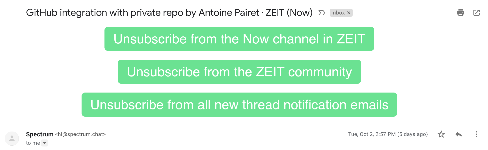
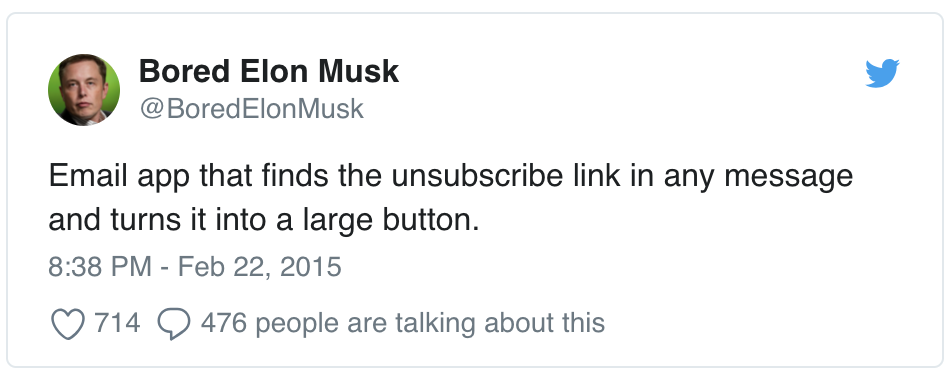

# Enlarge The Unsubscribe Button

> Chrome extension - Enlarge the "unsubscribe" button in emails

 

	

Inspired by [Bored Elon Musk](https://twitter.com/boredelonmusk):

	

Currently only _Gmail_ is supported.

## Install

Install [manually](http://superuser.com/a/247654/6877).

## License

MIT © [Itai Steinherz](https://github.com/itaisteinherz)
